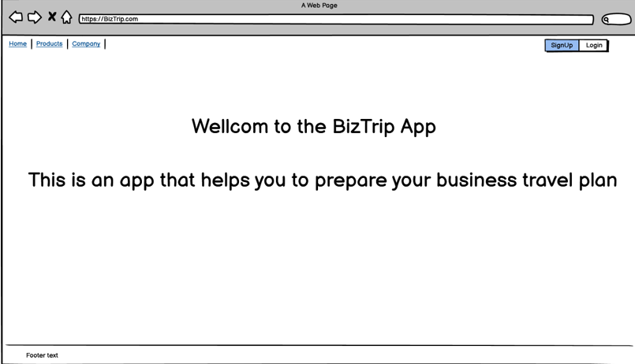
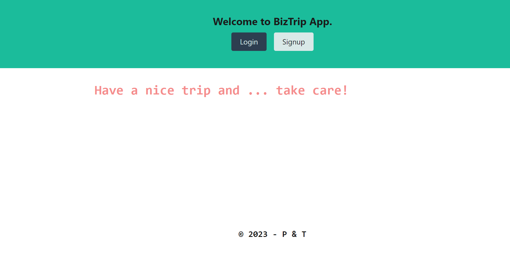

## Title

- BizTrip

## Table of Contents

- [Description](#description)
- [User Story](#user-story)
- [Technology Used](#technolgy-used)
- [Links](#links)
- [Installation](#installation)
- [License](#license)

## Description

- BizTrip is a bussiness trip application to plan, manage & resolve complexity of trip inorder to have safe journey.
- Based on OHS (WHS) safety is very important on travel, so this application created to resolve any complexity on a business trip..

## User Story

- As a business traveller, I want tohave an app to plan, manage & store my trip details, so I can have controlled & safely journey.

## Technolgy Used

- JavaScript
- Node.js
- Express
- React
- Apollo Server
- Graphql
- Mongodb
- Mongoose
- Styled-Components
- Google Map

## Installation

- Installation of npm packages required (`npm install`)
- Run `npm run develop` on your terminal.
- OR use URL deployed application link on Links section.

## Links

- [URL of the functional deployed application](https://warm-scrubland-92749.herokuapp.com/)
- [URL of the GetHub Repository](https://github.com/Tesfa8186/BizTrip)

-
- 
- 
- 
- 

## License

