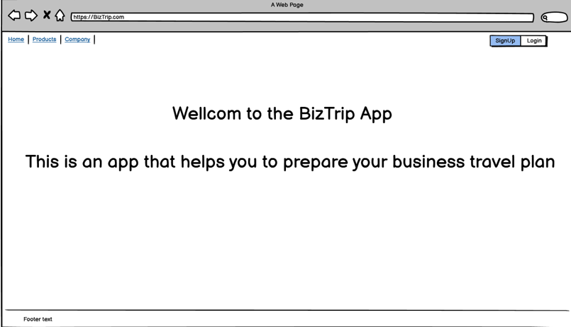
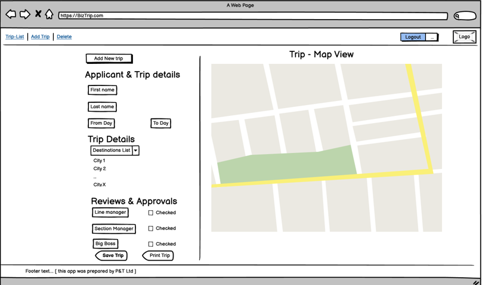
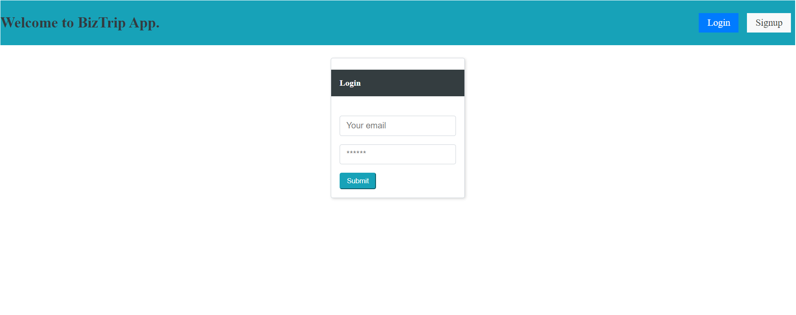
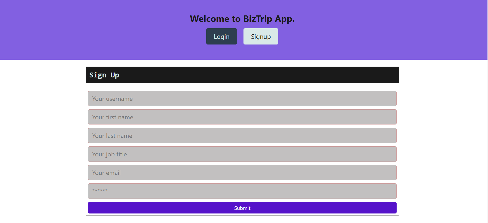

## Title

- BizTrip

## Table of Contents

- [Description](#description)
- [User Story](#user-story)
- [Deployed](#deployed)
- [Technology Used](#technolgy-used)
- [Installation](#installation)
- [Links](#links)
- [Future Development](#future-development)
- [Credit](#credit)
- [License](#license)

## Description

- BizTrip is a bussiness trip application to plan, manage & resolve complexity of trip inorder to have safe journey.
- Based on OHS (WHS) safety is very important on travel, so this application created to resolve any complexity on a business trip..

## User Story

- As a business traveller, I want to have an app to prepare & manage my travel plan, so I can have safely journey.

## Deployed

- This application is deployed at Heroku on this link: https://warm-scrubland-92749.herokuapp.com/

## Technolgy Used

- JavaScript
- Node.js
- Express
- React
- Apollo Server
- Graphql
- Mongodb
- Mongoose
- Styled-Components
- Google Map

## Installation

- Installation of npm packages required (`npm install`)
- Run `npm run develop` on your terminal.
- OR use URL deployed application link on Links section.

## Links

- [URL of the functional deployed application](https://warm-scrubland-92749.herokuapp.com/)
- [URL of the GetHub Repository](https://github.com/Tesfa8186/BizTrip)

- 
- 
- 
- 

## Future Development

- Map display & interaction
- More pages (OSH, Equipment, Tracking ...)
- Document Generation
- Electronic Signature
- Email Genaration
- Support

## Credit

- [Panos](https://github.com/PanosGian)

- [Tesfa](https://github.com/Tesfa8186)

## License

- Covered by 
